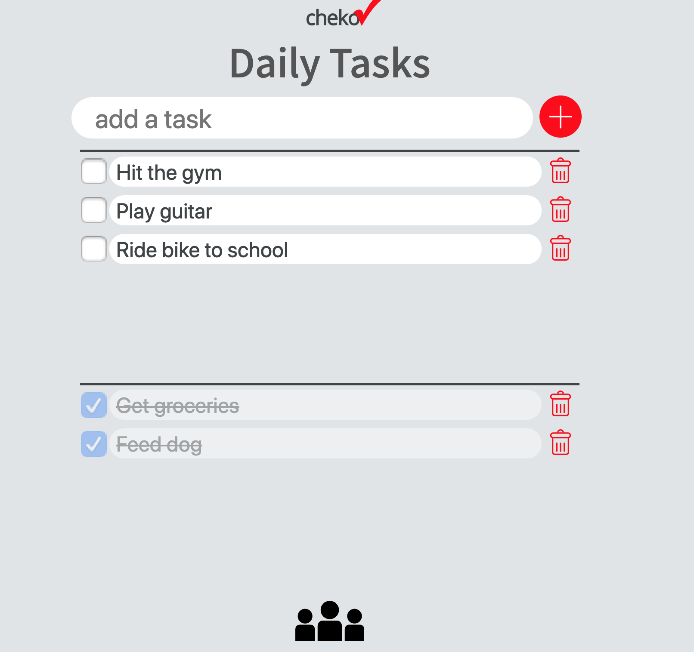

## Chekov To Do List
[Deployed Site](https://abc-s.github.io/201-final-project/lists.html)  
[Github](https://github.com/abc-s/201-final-project/)

### Project Overview
Chekov is a to do list application built in vanilla Javascript. It was built by a team of four software development students with less than 1 month of programming experience, over a period of 4 days.

### Personal Contributions
- Project architecture and planning
- Add/Delete functionality
- CSS styling