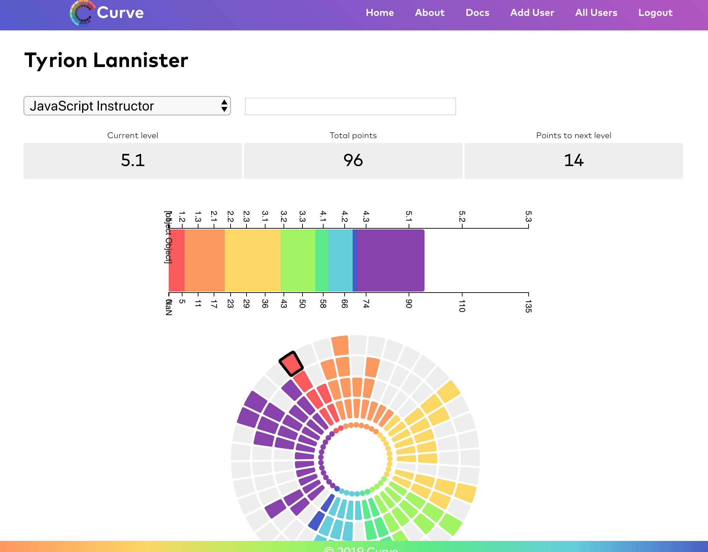

[Deployed Site](https://codefellows-curve.netlify.com)  
[Github](https://github.com/CodeFellows-Curve/curve-front-end/)

### Project Overview
Curve is an employee metrics and growth tracking application. It utilizes D3 to provide visual insights of employee values, work strengths and weaknesses. The application was built by a multidisciplinary project team, over 4 days, using both JavaScript and C#/.NET programming languages.

### Personal Contributions
I worked on the frontend JavaScript team troubleshooting Gatsby/GraphQL implementation for database queries, providing unit testing for rendered components, and building the project documentation using DocZ.

### Project Features
- GatsbyJS
- GraphQL
- D3
- Styled Components