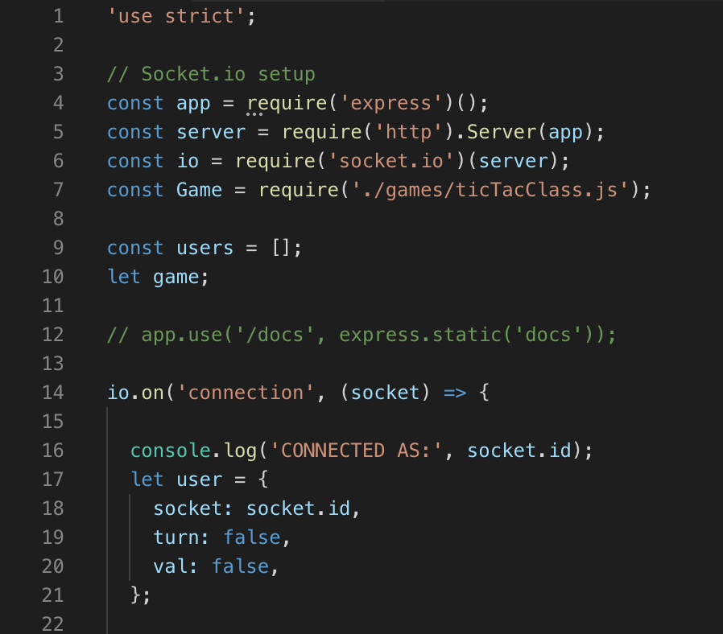

[Github](https://github.com/band-camp/301-final-project)

### Project Overview
Tic-tac-node is a web socket based gaming server built on Node.js. In addition, a universal client was built so that the server could integrate with a separate development team's application and provide real time gaming for users. A tic-tac-toe game was included as proof of concept, but the server and client are extensible to additional 2 player console games.

### Personal Contributions
- Architected server logic utilizing live web sockets via Socket.io
- Developed universal "client" with separate development team to provide cross application communication

### Features and Tools
- Node.js
- Socket.io
- Universal client